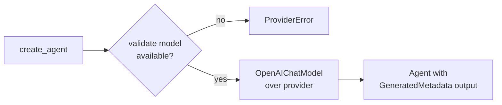

# AI providers

photo-tagger talks to a local vision-language model through an OpenAI-compatible chat API. Two
backends are supported, both running on your own machine: [Ollama](https://ollama.com/) and
[LM Studio](https://lmstudio.ai/). The HTTP calls and the structured-output decoding are handled by
[pydantic-ai](https://ai.pydantic.dev/), so the rest of the pipeline only ever sees a validated
result object.

## The two backends

Both backends speak the same OpenAI-compatible protocol, so picking one is mostly a matter of which
server you already run. LM Studio is the default provider.

| Provider  | `--provider` value | Default base URL            | Base-URL env var     |
| --------- | ------------------ | --------------------------- | -------------------- |
| LM Studio | `lmstudio`         | `http://localhost:1234/v1`  | `LM_STUDIO_BASE_URL` |
| Ollama    | `ollama`           | `http://localhost:11434/v1` | `OLLAMA_BASE_URL`    |

You point photo-tagger at a backend in three ways, in order of precedence (CLI flags win):

- `--provider ollama` or `--provider lmstudio` selects the backend. Omit it to get LM Studio.
- `-u/--url URL` overrides the base URL. The matching env var is `LM_STUDIO_BASE_URL` or
    `OLLAMA_BASE_URL`. When neither is set, the provider's default URL above is used.
- `-k/--api-key KEY` sets the API key. Prefer the env vars: `OLLAMA_API_KEY` for Ollama, and
    `LM_STUDIO_API_KEY` (with `OPENAI_API_KEY` as a fallback) for LM Studio. Local servers usually
    do not require a key.

The model identifier comes from `-m/--model` (or the `MODEL_NAME` env var) and defaults to
`qwen/qwen3-vl-30b`.

For example, to run against a local Ollama server with all defaults:

```bash
photo-tagger -i ./photos --provider ollama --model qwen3-vl
```

Or set everything once through the environment so the flags can stay off the command line:

```bash
export OLLAMA_BASE_URL=http://localhost:11434/v1
export MODEL_NAME=qwen3-vl
photo-tagger -i ./photos --provider ollama
```

!!! tip "Choosing and pulling a model"

    Use a vision-language model, since photo-tagger sends the image as input. Qwen3-VL is a good
    starting point. With Ollama, pull it once with `ollama pull qwen3-vl`; with LM Studio, download the
    model from its UI and start the server. `create_agent()` checks the model is available before any
    photos are processed, so a typo in `-m/--model` fails fast with a clear error instead of midway
    through a batch.

## How `create_agent` builds the agent

[`ai.py`](https://github.com/jbsilva/photo-tagger/blob/main/src/photo_tagger/ai.py) wires the
backend into a pydantic-ai `Agent`. The flow is the same for both providers:



`create_agent()` resolves the base URL, then validates that the requested model is actually present
on the provider before doing anything else. It queries LM Studio's `/v1/models` listing or Ollama's
`/api/tags`; if the model name is not found, it raises a `ProviderError` so the run stops before
wasting time on images. Once validation passes it constructs an `OpenAIChatModel` over the provider
and wraps it in an `Agent` whose `output_type` is `GeneratedMetadata`.

## Structured output and retries

The agent does not return free text. pydantic-ai instructs the model to produce structured output
and decodes the response into `GeneratedMetadata`, defined in
[`models.py`](https://github.com/jbsilva/photo-tagger/blob/main/src/photo_tagger/models.py):

- `title`: a short title (length-capped).
- `description`: a short description (length-capped).
- `keywords`: a list of hierarchical keywords (count-capped).

If the model returns something that fails schema validation (a malformed payload, an over-long
field), pydantic-ai retries the call. The number of attempts is controlled by `--retries` (env var
`RETRIES`, default `5`). The per-image timeout also feeds into this loop: on a timeout the retry
logic steps in. `analyze_image_with_ai()` runs the agent and returns an `InferenceResult` carrying
the validated metadata plus token usage and wall-clock seconds.

!!! warning "Keyword cap is silent, length caps trigger retries"

    `GeneratedMetadata` truncates an over-long keyword list silently rather than rejecting it, so a
    model that overshoots the requested keyword count does not burn retries. Over-long `title` or
    `description` fields, by contrast, fail validation and do cost a retry attempt.

## Sampling settings

These flags shape how the model generates each response. All have env-var equivalents and config
file keys under `[inference]`.

| Flag                  | Env var             | Default | Effect                                          |
| --------------------- | ------------------- | ------- | ----------------------------------------------- |
| `--temperature`       | `TEMPERATURE`       | `0.2`   | Sampling temperature; lower is more focused.    |
| `--max-tokens`        | `MAX_TOKENS`        | `1200`  | Maximum tokens to generate per image.           |
| `--frequency-penalty` | `FREQUENCY_PENALTY` | `0.5`   | Penalizes repeated tokens to avoid loops.       |
| `--timeout-seconds`   | `TIMEOUT_SECONDS`   | `60.0`  | Per-image inference timeout; feeds the retries. |

## Keeping token use low

The model never sees the original file. Before each call,
[`image_io.py`](https://github.com/jbsilva/photo-tagger/blob/main/src/photo_tagger/image_io.py)
loads the image (rawpy for RAW, Pillow otherwise), applies EXIF orientation, flattens transparency
onto white, downscales it, and JPEG-encodes the bytes that go to the model. A full-resolution RAW or
JPEG would inflate token counts and slow inference for no benefit, so two flags bound the payload:

- `--jpeg-dimensions` (env var `JPEG_DIMENSIONS`, default `1280`) caps the longest side, in pixels,
    of the JPEG sent to the model.
- `--jpeg-quality` (env var `JPEG_QUALITY`, default `80`) sets the JPEG compression quality, from 1
    to 100.

Because these inputs change the model's response, they are part of the cache key. See
[Caching and locking](caching.md) for how reruns reuse a previous result. For the full option list,
see the [CLI reference](../usage/cli-reference.md), and for the downstream keyword handling see
[Metadata and keywords](metadata.md).
