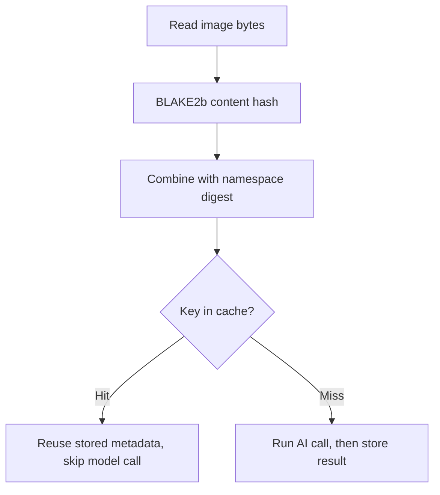

# Caching and locking

Two optional artifacts make repeated runs faster and safer: a SQLite cache that skips redundant
model calls, and a cross-platform lock that stops two runs from racing on the same folder. Both are
opt-in and controlled by a single flag each.

## Caching

[`cache.py`](https://github.com/jbsilva/photo-tagger/blob/main/src/photo_tagger/cache.py) provides
`InferenceCache`, a SQLite database opened in WAL (write-ahead logging) mode. Enable it with
`--cache-file PATH`. The file is created if it does not exist, and a cache hit skips the model call
entirely, so reruns on an unchanged folder are fast and free.

### Cache key

Each entry is keyed by two parts:

| Part               | What it is                                                             |
| ------------------ | ---------------------------------------------------------------------- |
| Image content hash | A BLAKE2b digest of the image bytes, so identical pixels hit the cache |
| Namespace digest   | A digest of the model name, user prompt, and sampling settings         |

`build_cache_namespace()` produces the namespace digest from the model name, the user prompt, and
the sampling settings: `temperature`, `max_tokens`, `frequency_penalty`, `jpeg_dimensions`, and
`jpeg_quality`. The system prompt is intentionally excluded from the digest because it ships with
the code and changes only when you upgrade photo-tagger.

The split key means a cached result is reused only when both the image and every input that could
change the model's answer are the same. Change the model or the prompt and you naturally get fresh
entries, with the old ones simply going unused.

### Lookup flow



### Managing the cache

The cache file is safe to delete at any time. The next run simply repopulates it: deleting it costs
you only the model calls you would have skipped, never any metadata already written to your photos.
Because changing the model or prompt produces a different namespace digest, you do not need to clear
the cache when you switch models; stale entries are just never looked up again.

!!! tip "Combine `--cache-file` across reruns"

    Point every run at the same `--cache-file` to get the most out of it. A first pass tags the folder
    and fills the cache; a later rerun (for example after adding a few new photos, or with `--workers`
    bumped up) reuses the stored results for every unchanged image and only calls the model for the new
    or changed ones.

## Locking

[`locking.py`](https://github.com/jbsilva/photo-tagger/blob/main/src/photo_tagger/locking.py)
provides `FileLock`, a thin wrapper over the `filelock` library that works on Linux, macOS, and
Windows. Enable it with `--lock-file PATH`.

The lock is exclusive and non-blocking: photo-tagger calls `acquire(timeout=0)` and, if another
photo-tagger process already holds the lock, raises `LockHeldError` and refuses to start instead of
waiting. This guarantees that two runs cannot race on the same folder and write conflicting metadata
at the same time.

```bash
# Point both runs at the same lock file; the second one refuses to start.
photo-tagger -i ~/Photos --lock-file ~/Photos/.photo-tagger.lock
```

!!! warning "Use one lock file per folder"

    The lock guards whatever you choose to protect, not the input path automatically. Always use the
    same `--lock-file` for runs that touch the same folder, otherwise two runs with different lock files
    will not see each other and can still overlap.

## Related pages

- [Processing pipeline](pipeline.md) shows where the cache lookup and lock acquisition sit in
    `run_batch()`.
- [CLI reference](../usage/cli-reference.md) lists `--cache-file` and `--lock-file` with their
    defaults.
