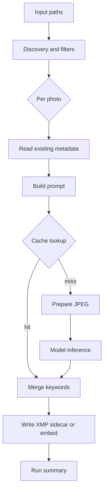

# Architecture

photo-tagger turns a set of input paths into Lightroom-compatible metadata by running each photo
through a local vision-language model and writing the result back as an XMP sidecar (the default) or
embedded in the image file. The work is split into small, focused modules so that discovery,
prompting, inference, caching, keyword merging, and metadata writing can each be tested and reasoned
about on their own.

This section explains how those pieces fit together. The pages below go module by module; this
overview shows the high-level flow and a map of every module under `src/photo_tagger/`.

## High-level flow

The orchestrator resolves a batch of images, then processes each photo through the same sequence. A
cache hit short-circuits the model call, which is the slowest step.

The per-photo steps run inside `run_batch()`. Photos that fail are retried once in a second pass,
and the final run summary reports success and failure counts, token usage, and wall time.

## Modules

Each module under `src/photo_tagger/` owns one part of the flow. Names link to the source on `main`;
table cells cannot hard-wrap, so the link targets live in the reference block below.

| Module                              | Responsibility                                                                                                                                                                           |
| ----------------------------------- | ---------------------------------------------------------------------------------------------------------------------------------------------------------------------------------------- |
| [`main.py`][main]                   | cyclopts entry point: the `tag()` default command (orchestration) and the `doctor` command. Resolves the batch, acquires the lock, runs the batch, emits NDJSON, and writes the summary. |
| [`cli_options.py`][cli_options]     | The CLI schema: the seven `@dataclass` flag groups, their config-file defaults (`load_defaults`), and the `ProcessingOptions` mapping.                                                   |
| [`config.py`][config]               | Defaults, provider base URLs and keys, tag names, and the system and user prompts.                                                                                                       |
| [`config_file.py`][config_file]     | TOML loader: `find_config_file`, `load_config`, `apply_overrides`.                                                                                                                       |
| [`providers.py`][providers]         | Backend registry: a `ProviderBackend` (Strategy) per backend bundles its listing URL, listing parser, and provider factory; shared HTTP plumbing lives once. Hosts the `openai` backend. |
| [`discovery.py`][discovery]         | `resolve_image_batch()` expands and extension-filters inputs; `apply_skip_file`, `apply_date_filter`, and `apply_skip_tagged` narrow the batch.                                          |
| [`image_io.py`][image_io]           | `prepare_image_for_agent()` loads the image (rawpy for RAW, Pillow otherwise), fixes orientation, flattens alpha to white, resizes, and JPEG-encodes the bytes sent to the model.        |
| [`ai.py`][ai]                       | `create_agent()` builds a pydantic-ai Agent over an OpenAI-compatible model and checks it exists; `analyze_image_with_ai()` runs it and returns an `InferenceResult`.                    |
| [`models.py`][models]               | `GeneratedMetadata` (caps title and description length and keyword count), `InferenceResult`, and `KeywordSet` (the typed keyword value object).                                         |
| [`keywords.py`][keywords]           | `parse_hierarchical_keyword()` converts leaf-first form to Lightroom root-to-leaf pipe form; `merge_keywords()` merges and dedups case-insensitively, preserving hierarchy.              |
| [`diagnostics.py`][diagnostics]     | The checks behind `photo-tagger doctor`: ExifTool on PATH and provider/model reachability, returned as `CheckResult`s.                                                                   |
| [`metadata.py`][metadata]           | `read_image_context()` batches one exiftool read; `build_contextual_prompt()` appends it; `write_metadata()` writes the sidecar or embeds; `find_tagged_images()` detects tagged files.  |
| [`cache.py`][cache]                 | `InferenceCache`, a SQLite database (WAL mode) keyed by image content hash plus a namespace digest; a cache hit skips the model call entirely.                                           |
| [`locking.py`][locking]             | `FileLock` wraps the filelock library for a cross-platform, non-blocking exclusive lock.                                                                                                 |
| [`csv_report.py`][csv_report]       | `ReportRow` plus the streaming `CsvReportWriter` (CLI `--csv-file`) and batch `write_report` (GUI export): one spreadsheet row per photo, shared column schema across both frontends.    |
| [`pipeline.py`][pipeline]           | `run_batch()` orchestrates everything: serial or concurrent processing, the per-photo steps, retries, and streaming outcomes through callbacks.                                          |
| [`progress.py`][progress]           | rich progress bar on a TTY (stderr), no-op otherwise.                                                                                                                                    |
| [`logging_setup.py`][logging_setup] | loguru config: console sink to stderr (so stdout NDJSON stays clean) and a rotating, compressed file sink.                                                                               |
| [`errors.py`][errors]               | `PhotoTaggerError` (base), `ProviderError`, `DiscoveryError`, `BatchError`.                                                                                                              |

!!! note

    Serial runs (`--workers 1`) reuse one long-lived ExifTool process (`-stay_open`). Concurrent runs
    give each worker its own short-lived helper because pyexiftool's pipe is not thread-safe.

## Detail pages

- [Processing pipeline](pipeline.md): how `run_batch()` orders the per-photo steps, handles serial
    versus concurrent execution, retries failures, and streams outcomes.
- [AI providers](ai-providers.md): the backend registry (Ollama, LM Studio, OpenAI), agent
    construction, model validation, and schema-validation retries.
- [Metadata and keywords](metadata.md): reading existing context, the exact tags written, and how
    hierarchical keywords are parsed and merged.
- [Caching and locking](caching.md): the SQLite inference cache, its namespace digest, and the
    cross-platform file lock.

[ai]: https://github.com/jbsilva/photo-tagger/blob/main/src/photo_tagger/ai.py
[cache]: https://github.com/jbsilva/photo-tagger/blob/main/src/photo_tagger/cache.py
[cli_options]: https://github.com/jbsilva/photo-tagger/blob/main/src/photo_tagger/cli_options.py
[config]: https://github.com/jbsilva/photo-tagger/blob/main/src/photo_tagger/config.py
[config_file]: https://github.com/jbsilva/photo-tagger/blob/main/src/photo_tagger/config_file.py
[csv_report]: https://github.com/jbsilva/photo-tagger/blob/main/src/photo_tagger/csv_report.py
[diagnostics]: https://github.com/jbsilva/photo-tagger/blob/main/src/photo_tagger/diagnostics.py
[discovery]: https://github.com/jbsilva/photo-tagger/blob/main/src/photo_tagger/discovery.py
[errors]: https://github.com/jbsilva/photo-tagger/blob/main/src/photo_tagger/errors.py
[image_io]: https://github.com/jbsilva/photo-tagger/blob/main/src/photo_tagger/image_io.py
[keywords]: https://github.com/jbsilva/photo-tagger/blob/main/src/photo_tagger/keywords.py
[locking]: https://github.com/jbsilva/photo-tagger/blob/main/src/photo_tagger/locking.py
[logging_setup]: https://github.com/jbsilva/photo-tagger/blob/main/src/photo_tagger/logging_setup.py
[main]: https://github.com/jbsilva/photo-tagger/blob/main/src/photo_tagger/main.py
[metadata]: https://github.com/jbsilva/photo-tagger/blob/main/src/photo_tagger/metadata.py
[models]: https://github.com/jbsilva/photo-tagger/blob/main/src/photo_tagger/models.py
[pipeline]: https://github.com/jbsilva/photo-tagger/blob/main/src/photo_tagger/pipeline.py
[progress]: https://github.com/jbsilva/photo-tagger/blob/main/src/photo_tagger/progress.py
[providers]: https://github.com/jbsilva/photo-tagger/blob/main/src/photo_tagger/providers.py
