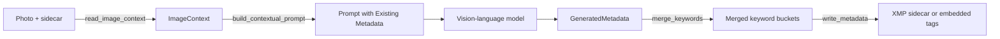

# Metadata and keywords

photo-tagger reads whatever metadata a photo already carries, feeds the useful parts into the model
prompt, and writes the result back as Lightroom-compatible tags. Two modules do this work:
[`metadata.py`](https://github.com/jbsilva/photo-tagger/blob/main/src/photo_tagger/metadata.py)
talks to ExifTool, and
[`keywords.py`](https://github.com/jbsilva/photo-tagger/blob/main/src/photo_tagger/keywords.py)
parses and merges hierarchical keywords. This page explains the round trip from read to write.

## Reading existing metadata

Before the model ever sees a photo, `read_image_context()` collects every read-only tag the pipeline
needs in a single `exiftool` call. Issuing one batched read instead of separate reads for keywords,
location, GPS, and camera EXIF keeps the per-photo IPC cost to one round trip. It returns an
`ImageContext`:

```python
@dataclass(slots=True, frozen=True)
class ImageContext:
    existing_keywords: KeywordSet  # typed subject / hierarchical / weighted views
    location_tags: dict[str, str]  # city/country from XMP-photoshop and IPTC
    gps_position: str | None       # Composite:GPSPosition, if present
    camera_info: dict[str, str]    # EXIF Model, LensModel, DateTimeOriginal
```

`KeywordSet` (in [`models.py`][models]) is a small dataclass with `subject`, `hierarchical`, and
`weighted` list fields. It replaced a bare `dict[str, list[str]]` keyed by those strings, so a
misspelled key is now a type error instead of a silently empty list.

The read targets both the image file and any adjacent `.xmp` sidecar, so metadata that lives only in
the sidecar is still picked up.

`build_contextual_prompt()` turns that context into a short "Existing Metadata" block appended to
the user prompt. The model gets the first few existing keywords, a `City, Country` location hint,
the GPS position, and the camera, lens, and capture date. Camera details are corroborative only: the
prompt instructs the model to use them to disambiguate what is visible, never to assert content the
image does not show.



## Hierarchical keywords

The model returns taxonomy chains in a dedicated `hierarchies` field, leaf-first and joined with
`<`, for example `Duck<Bird<Animal`. `analyze_image_with_ai()` folds those chains into the keyword
list, so from here on a hierarchical keyword is just a keyword that contains `<`. Lightroom expects
the inverse of that leaf-first form: a root-to-leaf path joined with pipes, `Animal|Bird|Duck`.
`parse_hierarchical_keyword()` does the conversion and also returns each level as a flat keyword:

```python
parse_hierarchical_keyword("Duck<Bird<Animal")
# ('Animal|Bird|Duck', ['Animal', 'Bird', 'Duck'])
parse_hierarchical_keyword("Landscape")
# ('Landscape', ['Landscape'])
```

A plain keyword with no `<` separator passes through unchanged as a single-level entry. Stray `>`
characters the model sometimes emits are dropped before parsing.

### Merging with existing tags

`merge_keywords()` combines the new AI keywords with whatever already lives on the photo. It keeps
three parallel buckets and preserves the hierarchy:

- `subject`: every level flattened into a single keyword list.
- `hierarchical`: cumulative pipe paths. Lightroom needs each prefix, so a `Animal|Bird|Duck` leaf
    also contributes `Animal|Bird`.
- `weighted`: a flat list that mirrors `subject`.

Deduplication is case-insensitive (compared with `casefold`), so a photo that already carries `Bird`
will not gain a second `bird`. The first-seen casing wins. When a leaf appears in more than one
chain, the longest observed chain is kept.

Two flag pairs control the merge:

- `--preserve-keywords` (default) merges new keywords with the existing ones. `--overwrite-keywords`
    replaces them instead.
- `--max-keywords N` caps how many AI-generated keywords are kept per photo before merging. The
    default keeps all of them.

!!! example

    Existing `Animal|Bird` plus the model output `Seagull<Bird<Animal` and `bird` merges to a
    `hierarchical` bucket of `['Animal|Bird', 'Animal|Bird|Seagull']`: the duplicate `Bird` is collapsed
    and the deeper chain is added.

## Writing metadata

`write_metadata()` builds one ExifTool payload and applies it in a single `set_tags` call. Each
piece of generated metadata is written to both an XMP tag and its IPTC or EXIF counterpart so that
different tools agree on the value. Lightroom prioritizes `IPTC:Keywords` for JPEGs, which is why
the flat subject list is mirrored there.

| Generated field    | Tags written                                      |
| ------------------ | ------------------------------------------------- |
| Flat keywords      | `XMP-dc:Subject`, `IPTC:Keywords`                 |
| Keyword hierarchy  | `XMP-lr:HierarchicalSubject`                      |
| Weighted flat list | `XMP-lr:WeightedFlatSubject`                      |
| Title              | `XMP-dc:Title`, `IPTC:ObjectName`                 |
| Description        | `XMP-dc:Description`, `XMP-exif:ImageDescription` |

Title and description are only written when `--write-title` and `--write-description` are enabled
(both are on by default). If the payload would be empty, nothing is written.

### Sidecar or embedded

By default photo-tagger writes an XMP sidecar named after the image (`image.cr3` gets `image.xmp`).
This leaves the original file byte-for-byte untouched. Pass `--embed-in-photo` to write the tags
into the image file instead.

=== "Sidecar (default)"

    ```text
    photos/
      duck.cr3        # original, never modified
      duck.xmp        # title, description, and keywords
    ```

=== "Embedded (--embed-in-photo)"

    ```text
    photos/
      duck.cr3        # metadata written into the file itself
    ```

!!! note

    Sidecars keep your originals completely untouched, and Lightroom reads the `.xmp` file alongside the
    photo on import. This is the safest option for RAW workflows, which is why it is the default.

### Backups and dry runs

When writing, ExifTool keeps a `*_original` backup of the target before changing it. This is on by
default. `--no-backup-xmp` passes `-overwrite_original` to ExifTool so no backup file is left
behind.

`--dry-run` runs the model and logs the proposed title, description, and keywords, but writes
nothing. Use it to preview output before touching any files.

!!! warning

    `--no-backup-xmp` combined with `--embed-in-photo` modifies the original image file with no backup.
    Make sure you have your own copies before running that combination.

## Detecting tagged images

`find_tagged_images()` powers the `--skip-tagged` filter. It batches one ExifTool read across all
candidate files and marks a photo as already tagged when the image or its sidecar has any of the
indicator tags populated: the keyword tags above, a title, or a description. See
[Processing pipeline](pipeline.md) for where this filter runs in the batch.

## Related pages

- [Processing pipeline](pipeline.md): how the read, prompt, merge, and write steps are orchestrated
    per photo.
- [AI providers](ai-providers.md): how the prompt reaches the model and the structured output comes
    back.
- [CLI reference](../usage/cli-reference.md): the full list of output and filter flags referenced
    here.

[models]: https://github.com/jbsilva/photo-tagger/blob/main/src/photo_tagger/models.py
