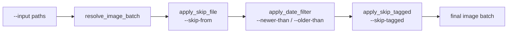
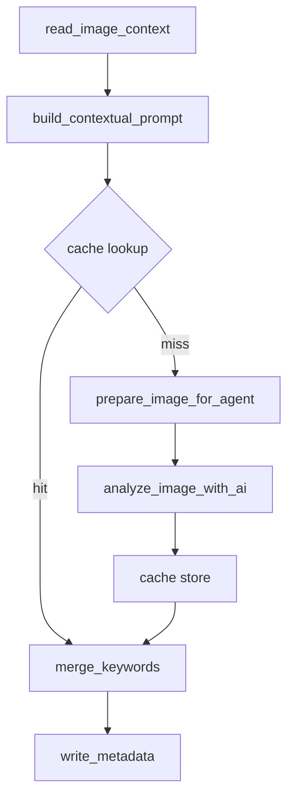

# Processing pipeline

The pipeline turns a list of input paths into written metadata. It runs in two stages: first
[`discovery.py`](https://github.com/jbsilva/photo-tagger/blob/main/src/photo_tagger/discovery.py)
resolves and filters the batch, then
[`pipeline.py`](https://github.com/jbsilva/photo-tagger/blob/main/src/photo_tagger/pipeline.py)
processes each surviving photo through the model and on to ExifTool.

## Input resolution and filtering

Before any photo touches the model, the batch is built up and then narrowed by a chain of filters.
Each step preserves input order and removes work, so the model only ever sees files that passed
every gate.

`resolve_image_batch()` expands the `-i/--input` paths into a flat list of files. Directories are
walked and matched against `--ext/--extensions` (case-insensitive, so `--ext cr3` also matches
`IMG.CR3`); `-r/--recursive` controls whether subdirectories are included. Explicit files are kept
as is, the extension filter does not apply to them. Duplicates are removed. If the extension list is
empty, no inputs were given, or nothing matched, the function raises a `DiscoveryError` and the CLI
exits with code 1.

The resolved list then passes through three optional filters, in this order:

| Step                | Flag                            | What it removes                          |
| ------------------- | ------------------------------- | ---------------------------------------- |
| `apply_skip_file`   | `--skip-from PATH`              | Files whose name or full path is listed. |
| `apply_date_filter` | `--newer-than` / `--older-than` | Files whose mtime is outside the window. |
| `apply_skip_tagged` | `--skip-tagged`                 | Files that already have keywords/title.  |

The skip list is newline-delimited; blank lines and lines starting with `#` are ignored. The date
filter compares each file's modification time, not EXIF capture time, because reading EXIF off every
file would cost an extra ExifTool pass. Bounds are exclusive: `--newer-than` drops files on or
before the instant, `--older-than` drops files on or after it. `--skip-tagged` uses one read per
file via `find_tagged_images()`; see [Metadata and keywords](metadata.md) for what counts as
"tagged".

!!! tip

    Pair `--append-to-skip-file run.txt` on one run with `--skip-from run.txt` on the next. The appender
    records every successfully tagged filename as work progresses, so a re-run after a crash skips
    finished photos without redoing them.

## Per-photo steps

`run_batch()` orchestrates the run, and `process_photo()` does the work for a single image. Every
photo goes through the same ordered steps inside a managed ExifTool helper.

1. **`read_image_context`** does a single ExifTool read of the photo's existing keywords, location,
    GPS, and camera EXIF, returning an `ImageContext`.
2. **`build_contextual_prompt`** appends that context (existing keywords, location tags, GPS, camera
    info) to the user prompt so the model can reuse and extend what is already there.
3. **Cache lookup** runs only when `--cache-file` is set. The key is the image content hash plus a
    namespace digest of the model and sampling settings. A hit replays the stored result and skips
    the model entirely. Cache I/O failures are logged at warning level and treated as a miss, never
    raised, so a corrupt SQLite file degrades to "no cache" instead of aborting the photo. See
    [Caching and locking](caching.md).
4. **`prepare_image_for_agent`** (on a miss) loads the image (rawpy for RAW, Pillow otherwise),
    applies EXIF orientation, flattens alpha to white, resizes to `--jpeg-dimensions`, and
    JPEG-encodes the bytes at `--jpeg-quality`.
5. **`analyze_image_with_ai`** sends those bytes to the model with the sampling settings and returns
    a validated `InferenceResult` (title, description, keywords, token usage, seconds). On a miss
    the result is written back to the cache. See [AI providers](ai-providers.md).
6. **`merge_keywords`** merges the model's keywords with the existing ones. With
    `--preserve-keywords` (the default) the existing keywords form the base; with
    `--overwrite-keywords` the base is empty. `--max-keywords` caps how many AI keywords are kept
    before merging.
7. **`write_metadata`** writes the merged keywords, title, and description through ExifTool, to an
    XMP sidecar by default or into the file with `--embed-in-photo`. `--no-write-title` and
    `--no-write-description` suppress those fields. See [Metadata and keywords](metadata.md).

With `--dry-run`, steps 1 through 6 still run (so the model is queried and the cache is consulted),
but step 7 is replaced by a log line previewing the proposed metadata. Nothing is written.

## Retry pass

`run_batch()` runs two passes. Photos that fail the first pass are collected and retried once in a
second pass. A photo "fails" when `write_metadata` returns false or when any step raises. First-pass
failures are logged as `file_queued_for_retry`; if the retry also fails, the photo is logged as
`file_failed_after_retry` and listed in the final summary. The progress bar only advances when a
photo is truly done (first-pass success, or any retry-pass outcome), so a flaky file that recovers
on retry never makes the bar overshoot.

The two-pass structure is separate from the model's own `--retries`. Those retries happen inside a
single `analyze_image_with_ai` call when the model output fails schema validation; the pipeline's
retry pass re-runs the whole photo once more after the first pass finishes.

## Callbacks

`run_batch()` does not write any artifacts itself. It streams per-image outcomes and final totals
through optional callbacks that the CLI wires up. Each callback is invoked defensively: a callback
that raises is logged and swallowed so it cannot abort the batch.

| Callback          | Wired to                                     | Fires                                    |
| ----------------- | -------------------------------------------- | ---------------------------------------- |
| `on_image_result` | NDJSON emitter (`--json`)                    | Once per photo, with the `ImageOutcome`. |
| `on_success`      | skip-list appender (`--append-to-skip-file`) | Once per successful photo.               |
| `on_complete`     | summary writer (`--summary-file`)            | Once at the end, with the `BatchTotals`. |

The NDJSON emitter writes one JSON line per photo to stdout (file, status, `from_cache`, `retry`,
title, description, keywords, token counts, seconds). Logs and the progress bar stay on stderr, so
stdout pipes cleanly into `jq`. The skip-list appender is built by `make_skip_list_appender()` and
appends each success to the skip file, deduplicating under a lock so concurrent workers never
produce interleaved or duplicate lines. The summary writer serializes the run totals (success and
failure counts, failed files, token usage, wall time) to the `--summary-file` as JSON.

## Graceful interruption

A `KeyboardInterrupt` (Ctrl-C) is handled rather than crashing the run. The current pass stops,
every photo that was still pending is marked failed, and the retry pass is skipped. `run_batch()`
still builds the `BatchTotals` and fires `on_complete`, so the summary file reflects what actually
finished. In serial mode the interrupt lands cleanly between photos. In concurrent mode it cancels
queued futures and stops accepting new work, but workers already in flight cannot be interrupted
from outside, so this is a best-effort quick stop rather than an instant abort.

## Concurrency

`-w/--workers` controls how many photos run at once, and it changes how ExifTool is driven.

=== "workers=1 (default)"

    The batch runs serially in the calling thread, reusing a single long-lived `ExifToolHelper`. Every
    metadata read and write goes through one long-running `exiftool` subprocess (`-stay_open`), which
    avoids the cost of spawning a process per photo.

=== "workers>1"

    The batch runs on a `ThreadPoolExecutor`. Each task opens its own short-lived `ExifToolHelper` for
    the duration of one photo and closes it afterward.

The reason for the split is that pyexiftool's `-stay_open` pipe is a single stdin/stdout channel per
helper and is not safe to share across threads. Concurrent tasks therefore each get their own helper
instead of sharing the long-lived one.

!!! note

    More workers does not always mean a faster run. The model server is usually the real bottleneck, so
    concurrency mostly helps overlap ExifTool and image-decoding work with inference. Raising
    `--workers` past what your model server can serve in parallel just queues requests.
