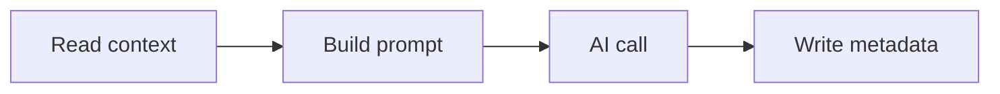

# Documentation

This site is built with [Zensical](https://zensical.org). The site is configured in
[`zensical.toml`](https://github.com/jbsilva/photo-tagger/blob/main/zensical.toml) at the repository
root, and the page sources live as Markdown under `docs/`. This page explains how to preview, build,
and write those pages.

## Preview locally

Run a local development server that watches the sources and reloads on every change:

```bash
uv run --group docs zensical serve
```

The site is served at <http://localhost:8000>. To use another port, pass an explicit address with
`-a`:

```bash
uv run --group docs zensical serve -a localhost:8001
```

## Build the static site

To produce the static HTML without serving it, run the build:

```bash
uv run --group docs zensical build
```

The output is written to `site/`, which is gitignored. It is a build artifact, so it is never
committed; only the Markdown sources under `docs/` and the `zensical.toml` config live in the
repository.

## Publishing

The site is published automatically by [`.github/workflows/docs.yml`][docs-workflow]. On pushes to
`main` that touch the docs sources, the workflow runs the build and deploys the result to GitHub
Pages:

```bash
uv run --only-group docs --locked --no-build zensical build --clean
```

The `--locked` flag fails if `uv.lock` is out of date, `--no-build` skips building the project
itself (only the `docs` group is needed), and `--clean` wipes the output directory before writing.
The published site lives at <https://jbsilva.github.io/photo-tagger/>.

## Page structure

The navigation tree is defined by the `nav` table in `zensical.toml`, which maps each page title to
its source file. Adding a page means creating the Markdown file under `docs/` and adding it to that
`nav` table.

Each page starts with a small block of YAML front matter that sets the page icon, followed by a
single H1 heading and a short intro:

```markdown
---
icon: lucide/book-open-text
---

# Page title

A one to three sentence intro that says what the page covers.
```

## Authoring syntax

Beyond plain Markdown, the theme supports a few extensions. An admonition is a fenced callout; the
body is indented four spaces after a blank line:

```markdown
!!! note

    This is the body of the note.
```

Content tabs group genuine alternatives behind labeled tabs:

```markdown
=== "Ollama"

    Steps for Ollama.

=== "LM Studio"

    Steps for LM Studio.
```

Mermaid diagrams render from a fenced ```` ```mermaid ```` block, which is handy for flows on the
architecture pages:

````markdown

````

## Style

Keep the prose consistent with the rest of the site:

- Hard-wrap prose and code at 100 columns.
- Use sentence-case headings ("Page structure", not "Page Structure"), with one H1 per page.
- Indent nested list items by four spaces.
- Link between pages with relative `.md` paths, for example [Testing](testing.md) or
    [Installation](../getting-started/installation.md). Use a `#kebab-anchor` to target a heading.
- Link to source code with absolute GitHub URLs on `main`, such as
    [`pipeline.py`](https://github.com/jbsilva/photo-tagger/blob/main/src/photo_tagger/pipeline.py).

!!! tip

    Preview the site with `uv run --group docs zensical serve` before you push. The local server catches
    broken links and rendering mistakes that are easy to miss in raw Markdown, and the docs deploy runs
    automatically once your change lands on `main`.

[docs-workflow]: https://github.com/jbsilva/photo-tagger/blob/main/.github/workflows/docs.yml
